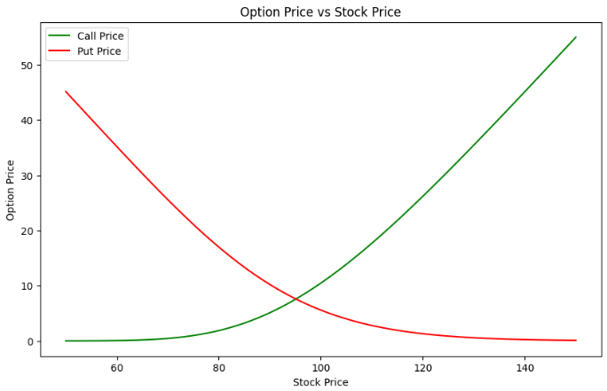
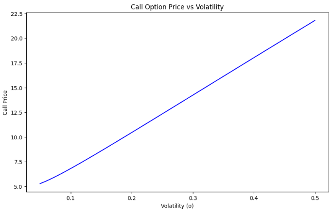
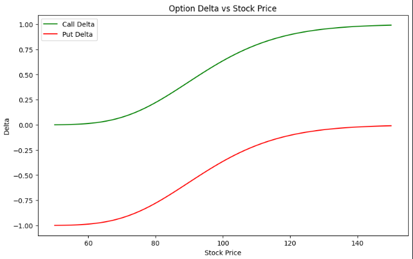

# ⚡ black-scholes option pricing


ever wondered how traders price options in milliseconds?

this repo will bring the legendary **black-scholes model** to life in python: clean, simple and extendable!


---

## 🏦 intro

options pricing is one of the biggest challenges in quantitative finance

before black-scholes, traders relied on **heuristics** and **slow simulations**

in 1973, fischer black, myron scholes andd robert merton introduced this model;
a closed form formula that forever changed finance

suddenly, traders could price european options in **microseconds** making modern derivatives markets possible


---

## 📐 the black-scholes formula

### Call Option
$$
C = S_0 \cdot N(d_1) - K e^{-rT} \cdot N(d_2)
$$

### Put Option
$$
P = K e^{-rT} \cdot N(-d_2) - S_0 \cdot N(-d_1)
$$

### Where:
$$
d_1 = \frac{\ln(S_0/K) + (r + \frac{\sigma^2}{2})T}{\sigma \sqrt{T}}, \quad
d_2 = d_1 - \sigma \sqrt{T}
$$


---

### parameters

- \( S_0 \): current stock price  

- \( K \): strike price  

- \( T \): time to maturity (in years)  

- \( r \): risk-free interest rate  

- \( \sigma \): volatility of the underlying asset  

- \( N(\cdot) \): CDF of the standard normal distribution


---

## black-scholes vs monte carlo


| feature                  |               black–scholes                              |               monte carlo                    |
|--------------------------|----------------------------------------------------------|----------------------------------------------|
| speed                    | very fast (closed-form)                                  | slower (needs many simulations)              |
| flexibility              | works for **european options** only                      | works for exotic/path-dependent options      |
| assumptions              | constant volatility, lognormal prices, no early exercise | fewer assumptions, can model many scenarios  |
| accuracy                 | exact (under assumptions)                                | approximate (improves with more simulations) |

when in practice:

- use **black-scholes** when assumptions hold --> super fast, benchmark model

- use **monte carlo** when pricing exotic/complex payoffs


---

## 🧮 implimentation

### exemple

```python```

from src.black_scholes import black_scholes_call, black_scholes_put

S = 100      # stock price

K = 105      # strike price

T = 1        # time to maturity (years)

r = 0.05     # risk-free rate

sigma = 0.2  # volatility

print("call:", black_scholes_call(S, K, T, r, sigma))

print("put:", black_scholes_put(S, K, T, r, sigma))

- run CLI demo

python src/main.py 


---

## 📊 visualizations

inside ```notebooks/demo.ipynb```, you'll find plots like:

- option price vs strike price (payoff curve)

- option price vs volatility (volatility smile)

- sensitivity analysis with greeks (delta, gamma, vega, theta, rho)


---

## exemple output 









---

## future work

- implied volatility solver

- greeks implimentation

- monte carlo comparison notebook

- option portfolio pricing

- advanced models (heston, SABR)


---

## ✨ why black-scholes still matters?

even with modern stochastic volatility models, black-scholes remains the benchmark:

- traders quote implied volatility using black-scholes model

- it's the foundation for risk management systems

- exchanges & clearinghouses rely on it for margin calculations


---

## ⚠️ limitations

- assumes constant volatility (not true in real markets --> volatility smiles)

- assumes lognormal price distribution

- only works for european-style options (no early exercise)

- ignores transaction costs and market frictions


---

## 🌍 real world extension

future versions of this repo may include:

- comparing real market option prices to black-scholes theoretical prices

- using black-scholes in reverse to extract implied volatility


---

## 🤝 contributing

contributions are more than welcome!

fork, build and PR, let's make this a solid finance playground


---

## 🙌 acknowledgments

- fischer black & myron scholes (1973): introduced the black–scholes formula

- robert merton: extended the model, earning the nobel prize with Scholes in 1997

- the global quant community, for continuously improving financial modeling